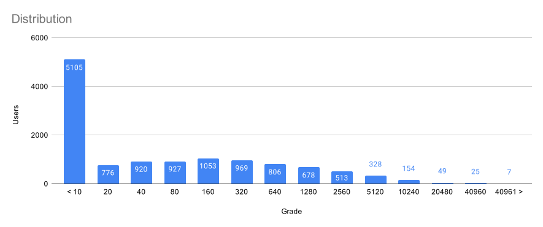
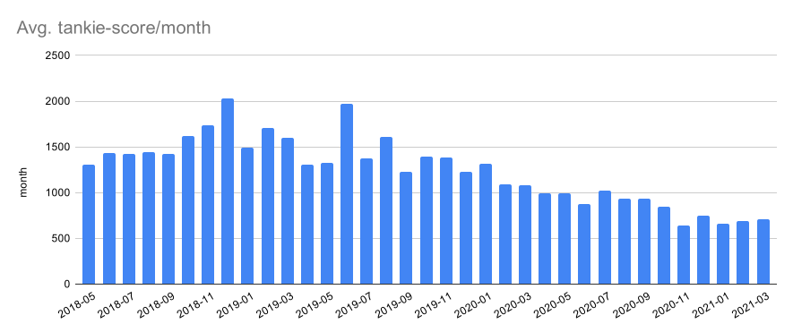

I wanted to learn Python, and was looking for a suitable project. The post u/bunkerparodie made a couple of months ago regarding the sub and tankies seemed like it would fit all my criteria.
 
 * Large dataset.
 * Required some sort of database.
 * Required working with JSON and APIs.
 * Sufficient size.
 * Beneficial in some way
 * Not another meaningless CRUD-exercise.


#
# **Methodology**

 First of all I had to get some sort of baseline, what is a tankie? Should there be some sort of sliding scale etc.

 1) So I went to our friendly r/sino, the various zedong-subs and parsed what subs* their moderators posted in. These then got added to the file "startsubs.json" with a score. 
 The score I choose is kind of arbitrary. The confirmed tankie-subs got a score of 2, left-leaning subs 0.1 to 1 depending on the amount of "no capitalists/reactionaries/liberals" I found in their rules.

 2) When that was done I started parsing r/shitwehraboossay via the Pushshift API. Collecting all posts and comments from now and 36 months back in one month chunks.

3) From that data I parsed all authors of posts & comments (trying to not catch too many bots) and got a list of authors. Around 12500 unique authors were harvested from this data.

4) For every author on this list I used the API to fetch **all** posts the user ever made (or at least all posts registered in the Pushshift DB). This took around 16 days due to rate-limiting. >_<

5) Authors then get graded in "tankie-ness" with the following formula. 

```
posts=10
comments=1
nPosts/Comments * subreddit-score = authorGrade
```
*So if I do one post in r/fullcommunism (score of 2) and three comments it will look like the following:*
```
(10*2) + ((3*1)*2) = 26
```

6) The authors "tankie-ness" got saved in a table in the database and this was then combined with the data from step #2. So if a user posted to r/sws during the month of 2020-09 that users tankie-score got added to that month, rinse and repeat until we get a "score" for the month. 

7) That score then got divided with the amount of posts + comments for the month in order to produce a final tankie-score for the month!

#
# **The Results**


In this figure all authors and their tankie-score is shown. As we can see, most authors have never posted in any of the subs that got collected during step #1.



Around 40% of the authors in r/sws had a score of less than 10. Peaking at about 1000 and then moving downwards pretty quick.




As we can see from the following graph the tankie-activity on r/sws actually has gone down! Great success! As for the reasons why I can only speculate, but I don't have time for that... I'm celebrating the downward trend!

#
# **FAQ-ish**

### ***Isn't mapping peoples political opinion exactly what the STASI, NKVD, IB, FBI ... did?***

The irony isn't lost on me...

### ***"LOL! r/prague1968ftw is a satirical sub!"***

I guess. This wasn't supposed to be some PhD disseration. If the scores are wonky you are more than welcome to clone the repository and do what I did, but with your scoring.


### ***Can I have the data?***

Not until I've seen proof of you donating at least $50 to Pushshift. The reasons why are two-fold. 

1) The data isn't anonymized. I really don't want it to be used for targeting users, even though they have a warped political opinion. A $50 donation to Pushshift (hopefully) provides enough of an obstacle to prevent this.

2) I hammered the Pushshift API for a little more than 2 weeks, 24 hours a day, every day. This is my way of giving back to them.


### ***Wait? All posts I've made are accessible? Even the deleted ones?***

Everything you've done on the internet is saved somewhere. Yes, even that cringey yaoi-novel with Goebbels and Göring you wrote as a misguided teenager... 

---
The code is available at https://github.com/pxtimes3/tankieWatch 

Comments on the quality of code can be sent to /dev/null, this was a hobby-project with the aim to learn the basic syntax of Python.